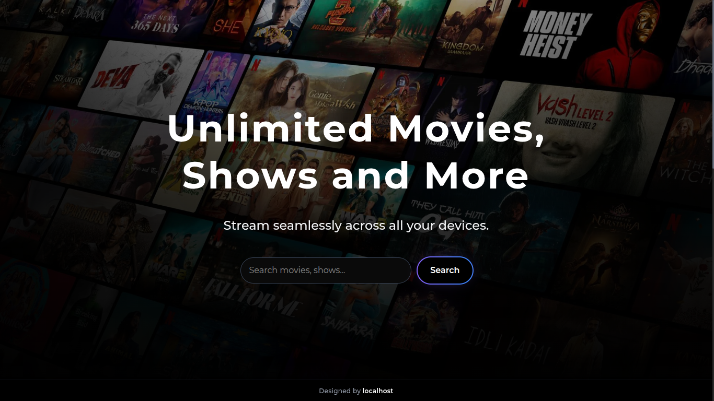
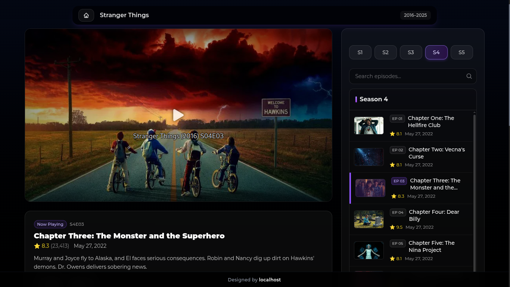

# Streamly

A Movies & Series streaming website built with Next.js , IMDB api , OMDB API and VIDSRC API, 

## Screenshots




## Installation

1. Clone the repository:
   ```bash
   git clone https://github.com/localhost969/Streamly.git
   cd Streamly
   ```

2. Install dependencies:
   ```bash
   npm install
   ```

3. Set up environment variables:
   Open`.env` file in the root directory and add your OMDB API key:
   ```
   NEXT_PUBLIC_OMDB_API_KEY=your_omdb_api_key_here
   ```

4. Run the development server:
   ```bash
   npm run dev
   ```

## Project Structure

```
STREAMLY_MAIN/
├── components/
│   ├── HeroSection.tsx
│   ├── MobileHeroSection.tsx
│   ├── MovieInfo.tsx
│   ├── RecentList.tsx
│   ├── SearchBar.tsx
│   ├── SearchResults.tsx
│   ├── SeriesPlayer.tsx
│   ├── TopBar.tsx
│   └── VideoPlayer.tsx
├── pages/
│   ├── _app.tsx
│   ├── _document.tsx
│   ├── index.tsx
│   └── watch/
│       └── [id].tsx
├── public/
├── styles/
│   └── globals.css
├── utils/
│   └── logger.ts
├── next-env.d.ts
├── next.config.ts
├── package.json
├── postcss.config.mjs
├── README.md
└── tsconfig.json
``` 
